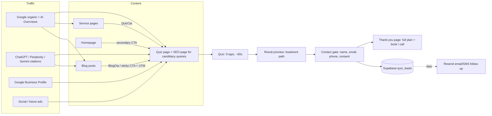

# Spec — SEO/AEO/GEO blog + implant lead-gen quiz

**Date:** 2026-09-29
**Status:** Built as a shell (2026-09-29). The Supabase migration is still to be applied, and the clinic answers in §10 are still needed before launch. The blog uses `@mdx-js/mdx` rather than fumadocs-mdx (see the plan status).
**Implementation plan:** [../plans/2026-09-29-seo-blog-lead-quiz-plan.md](../plans/2026-09-29-seo-blog-lead-quiz-plan.md)
**Reference implementation:** `/Users/cbsuperpatch/Desktop/Projects/PIRX/pirx-frontend` (blog, schema, robots, predictor lead funnel)

---

## 1. Goal

Drive organic, AI-answer-engine, and referral traffic to one conversion surface: a short **implant candidate quiz** that captures qualified leads (name, email, phone, answers, lead tier) into Supabase for the Renew Implant Centre front desk.

Success = more booked free consultations from people who self-qualified before they called.

### In scope

- Technical SEO foundation ported from PIRX (sitewide `@graph`, robots AI allowlist, sitemap, llms.txt, IndexNow, RSS, OG images, analytics events)
- MDX blog system ported from PIRX, with the PIRX answer-first post skeleton
- Quiz page (also an SEO content page), scoring, result view, thank-you page, Supabase lead store
- Quiz entry CTAs on blog posts, service pages, and the homepage
- Content program: writing skill, content calendar, first wave of posts

### Out of scope (separate projects)

- Email/SMS follow-up and front-desk notifications (**Resend**, planned separately)
- CRM sync (HighLevel or otherwise), online booking calendar, CallRail number swap
- Paid ads, French translation, admin dashboard UI (use the Supabase dashboard for now)

---

## 2. Current state (verified 2026-09-29)

| Area | State |
|---|---|
| Framework | Next 16.3.5, React 19.2, Tailwind v4, Vitest 3 (node env). Read `node_modules/next/dist/docs/` before writing code (see `AGENTS.md`) |
| Routing | `src/app/layout.tsx`, `src/app/page.tsx`, catch-all `src/app/[...slug]/page.tsx` rendering 29 slugs from `src/content/routes.ts` |
| Blog | 5 posts + index live as entries in `routes.ts` (`blog/*`); no MDX, no blog-specific components |
| Schema | `src/lib/site-schema.ts` has Dentist + WebSite, FAQPage, WebPage/BlogPosting builders. Sitewide graph **not injected** in layout; page schemas are emitted as separate scripts, not one `@graph` |
| Metadata | Root `metadata` + per-route `generateMetadata` (canonical, OG). No `robots.ts`, `sitemap.ts`, llms.txt, RSS, OG image routes |
| UI kit | Hand-rolled `src/components/ui/button.tsx` (cva + Slot). **No `components.json`** — shadcn not initialized |
| Lead capture | None. CTAs go to `/contact-us`, `tel:`, `mailto:`. The old live site used HighLevel forms |
| Pricing policy | Clinic **does not publish prices** (`recovered/pages/pricing.md`). The quiz must not show cost figures |
| Git | Repo initialized, no commits. Another session is editing this tree concurrently |

---

## 3. What we copy from PIRX

| PIRX asset | Path in PIRX | Renew adaptation |
|---|---|---|
| SEO/GEO/AEO playbook skill | `.cursor/skills/seo-geo-aeo/` (4 files) | Copy as-is into `.cursor/skills/seo-geo-aeo/` |
| Blog writing skill | `.cursor/skills/pirx-blog-writing/` | New `renew-blog-writing` skill with Renew terminology (§8) |
| Typed MDX frontmatter | `pirx-frontend/source.config.ts` | Renew fields (§6.2) |
| Blog loader + accessors + related posts | `src/lib/blog-source.ts`, `src/lib/blog.ts` | Same shape; clusters renamed |
| Blog JSON-LD | `src/lib/blog-schema.ts` | Add `MedicalWebPage` + `reviewedBy` + `lastReviewed`; Dentist publisher |
| Sitewide graph + author node | `src/lib/site-schema.ts`, `src/lib/site-author.ts` | Extend existing Renew `site-schema.ts`; Person nodes for Tom + implant surgeon |
| MDX components | `components/blog/*` (BlogCta, ExtractionTable, KeyStat, AuthorByline, StickyCta, TOC) | CTAs point to the quiz; add a **visible** FAQ section (PIRX only had FAQ in schema) |
| robots | `src/app/robots.ts` | Same AI allowlist; Renew private paths |
| sitemap, RSS, OG image, IndexNow | `src/app/sitemap.ts`, `blog/rss.xml/route.ts`, `blog/[slug]/opengraph-image.tsx`, `src/lib/indexnow.ts` | Same patterns |
| Funnel analytics | `src/lib/analytics.ts` (`FUNNEL_EVENTS`, `track`) | Quiz events (§7.4) |
| Lead form + table | `race-predictor/email-unlock-form.tsx`, migrations `133`/`136` | `quiz_leads` table, same RLS-deny-all + service-role write pattern, CASL consent column |
| SEO tests | `src/lib/__tests__/*schema*.test.ts`, `app/__tests__/robots.test.ts`, `sitemap.test.ts` | Same tests, Renew expectations |

**Deliberately not copied:** PIRX's schema-only blog FAQs (Renew shows FAQs visibly and in schema), PIRX locked terminology, `SoftwareApplication`/`WebApplication` types.

---

## 4. Funnel design



### 4.1 Traffic → quiz

- Every blog post: early `BlogCta`, sticky mobile CTA, closing CTA. All link to the quiz with `utm_source=blog&utm_medium=<placement>&utm_campaign=<post-slug>`.
- Every service page: a `QuizCta` block ("Not sure which option fits you? Take the 60-second quiz").
- Homepage: quiz as the secondary CTA beside "Book your free consultation".
- Google Business Profile website/appointment link: `?utm_source=gbp&utm_medium=organic`.
- The quiz page itself targets candidacy queries ("am I a candidate for dental implants", "All-on-4 candidate") and follows the full content skeleton, so it can rank and get cited on its own.

### 4.2 Why a quiz (and not only a contact form)

The pricing page already tells visitors "no numbers online, come for a free consult." That's a high-friction ask for someone still researching. The quiz gives them something back right away (a named treatment path plus what to expect), so they're willing to share contact details. Staff get answers and a lead tier before the first call.

---

## 5. Quiz specification

### 5.1 Name and URL

- Working name: **Implant Candidate Quiz**
- Page: `/implant-candidate-quiz` (indexable content page + embedded quiz)
- Thank-you: `/implant-candidate-quiz/thank-you?path=<result-path>` (noindex, no PII in the URL; ad platforms can use it as a URL-based conversion)
- Final name/slug is open question Q4 (§10)

### 5.2 Questions (v1 — `answersVersion: "v1"`)

One question per screen, tap to advance, Back button, progress bar. Answers stay in `localStorage` (no PII) so a refresh doesn't lose progress.

| # | id | Question | Options | Type |
|---|---|---|---|---|
| 1 | `situation` | Which best describes your teeth today? | Missing one or a few teeth · Missing many teeth or teeth are failing · I wear full or partial dentures · Previous dental work has failed | single |
| 2 | `arch` | Which area needs attention? | Upper · Lower · Both · Not sure | single |
| 3 | `frustrations` | What bothers you most right now? | Trouble eating · Dentures slip or feel loose · How my smile looks · Pain or discomfort · Speaking clearly | multi |
| 4 | `duration` | How long have you been dealing with this? | Under a year · 1–5 years · Over 5 years | single |
| 5 | `health` | Anything we should know before your consult? (optional) | I smoke · I have diabetes · I take blood thinners · None of these · I'd rather discuss it in person | multi, skippable |
| 6 | `comfort` | How do you feel about dental visits? | Comfortable · A bit nervous · Very anxious | single |
| 7 | `payment` | How are you thinking of paying? | Private insurance · CDCP · Payment plan · Paying myself · Not sure yet | multi |
| 8 | `timeline` | When would you like to start? | As soon as possible · Within 1–3 months · In 3–6 months · Just researching | single |
| 9 | `location` | Where are you coming from? | Orléans · Other Ottawa · Rockland / Clarence / Cumberland · Embrun / Casselman / Hawkesbury · Gatineau · Further away | single |

Question 5 is optional and coarse on purpose (data minimization, §9). Clinic may remove it (Q6).

### 5.3 Result paths (pure function `getResultPath(answers)`)

The primary path is chosen from `situation` (+ `frustrations`); modifiers add extra sections. Copy is educational ("people in your situation often explore…"), never a diagnosis.

| Path id | Trigger | Links to |
|---|---|---|
| `full-arch` | `situation` = many/failing | `/services/all-on-4-dental-implants`, `/services/full-arch-dental-implants`, `/services/same-day-dental-implants` |
| `denture-alternative` | `situation` = dentures | `/services/denture-alternative`, `/services/all-on-4-dental-implants` |
| `failed-work` | `situation` = failed work | `/services/failed-dental-work` |
| `individual` | `situation` = one or a few | `/what-to-expect`, `/blog/full-arch-vs-individual-dental-implants` |

| Modifier | Trigger | Adds section + link |
|---|---|---|
| `sedation` | `comfort` = nervous / very anxious | `/services/sedation-dentistry`, `/dental-anxiety` |
| `upper` / `lower` | `arch` = upper / lower | `/services/upper-jaw-implants` / `/services/lower-jaw-implants` |
| `coverage` | `payment` includes insurance / CDCP / payment plan | `/pricing` coverage + financing copy |
| `health-note` | `health` has any flag | "Your surgeon will review this at your free consult" (no clinical judgement) |
| `travel` | `location` = further away | home-visit / scheduling note (clinic to confirm) |

### 5.4 Lead score and tier (pure function `scoreLead(answers)`)

| Signal | Points |
|---|---|
| `timeline`: ASAP 40 · 1–3 mo 30 · 3–6 mo 15 · researching 5 | 5–40 |
| `situation`: many/failing 25 · dentures 25 · failed work 20 · one or a few 10 | 10–25 |
| `payment`: insurance / CDCP / plan / self 10 · only "not sure" 5 | 5–10 |
| `location`: any listed service area 10 · further away 0 | 0–10 |
| Chose "call me" as preferred contact | 5 |

Tiers: **hot** ≥ 70 · **warm** 45–69 · **nurture** < 45. Weights are config; tests freeze the tier boundaries. The tier is stored so staff (and later Resend) can triage.

### 5.5 Result preview → contact gate → thank-you

1. **Preview (ungated):** path name + 2-sentence explanation + "Get your personalized implant plan and a priority free consultation."
2. **Gate (shadcn form):** first name, email, phone, preferred contact (call / text / email), best time (optional), marketing consent checkbox (**unchecked by default**, optional), privacy note linking `/privacy-policy`. Hidden honeypot field + time-on-form check.
3. **Thank-you page:** full plan (path + modifier sections + links), "What happens next" (clinic calls within X business hours; X is Q7), primary "Call 613-841-6111" + "Book your free consultation" CTAs, 2–3 related posts.

### 5.6 Quiz page content (SEO/AEO surface)

Server-rendered around the client quiz island:

1. H1 + answer-first paragraph: who is typically a candidate for implants / All-on-4 (sourced, reviewed)
2. The quiz
3. One extraction table: candidacy factors (bone, gum health, smoking, diabetes, denture history) vs. what it means vs. what to ask at the consult
4. Question H2s ("Can I get implants if I've worn dentures for years?", "Am I too old for implants?", …)
5. Visible FAQ (3–6) = `FAQPage` schema
6. Reviewer byline + "Last reviewed" date
7. Sources

---

## 6. Blog specification

### 6.1 Architecture

- `fumadocs-mdx` collection at `content/blog/*.mdx` (same as PIRX; confirm compatibility with Next 16.3 at implementation time)
- Routes `/blog` and `/blog/[slug]` as dedicated App Router routes (static segments beat the `[...slug]` catch-all). The 5 existing posts and the blog index move out of `routes.ts`; **URLs don't change**
- `/blog/rss.xml`, `/blog/[slug]/opengraph-image.tsx`
- The HTML sitemap page (`/sitemap`) must keep listing posts

### 6.2 Frontmatter (zod, enforced at build)

```ts
{
  title: string;               // ≤ 60 chars, primary query front-loaded
  description: string;         // 150–160 chars
  datePublished: string;       // ISO date
  dateModified: string;
  lastReviewed: string;        // clinical review date
  cluster: "all-on-4" | "dentures-vs-implants" | "cost-coverage" | "candidacy-recovery" | "anxiety-sedation";
  primaryQuery: string;
  author: "tom-szarski" | "implant-surgeon";
  reviewedBy: "tom-szarski" | "implant-surgeon";
  quizCtaLabel: string;
  order: number;
  faqs: { q: string; a: string }[]; // min 3, rendered visibly + FAQPage
  heroImage?: string;
  heroImageAlt?: string;
}
```

### 6.3 Post skeleton (from the PIRX playbook)

Answer first (bold verdict, first 150 words) → one `ExtractionTable` → early `BlogCta` (quiz) → question-format H2s, each opening with a complete answer → `KeyStat` for sourced numbers → "Why Renew" section (onsite lab, same-day, one team, CDCP) → visible FAQ → closing CTA → `## Sources`.

### 6.4 Structured data per post (`@graph`, ≥ 3 types)

`MedicalWebPage` (with `reviewedBy` Person, `lastReviewed`) · `BlogPosting` (`author` Person, `publisher` → `#practice`, `mainEntityOfPage` → the page) · `FAQPage` · `BreadcrumbList` · `ImageObject` (when there's a hero image). Dentist and WebSite are referenced by `@id` from the sitewide graph.

---

## 7. Technical SEO + measurement

### 7.1 Sitewide graph (root layout)

`Dentist` (`@id` `…/#practice`: NAP, geo, areaServed, availableLanguage, `sameAs` = GBP + socials, `founder` → Tom) · `WebSite` · `Person` Tom Szarski (jobTitle **Denturist**, DD, George Brown College, DAO board) · `Person` implant surgeon (needs Q1). Injected once in `layout.tsx`. Route pages emit a single `@graph` referencing these `@id`s instead of separate scripts.

### 7.2 Crawl surface

- `robots.ts`: PIRX AI allowlist (OAI-SearchBot, ChatGPT-User, PerplexityBot, Claude-*, GPTBot, Google-Extended, Applebot-Extended, Amazonbot); block Bytespider and CCBot; disallow `/api/` and `/implant-candidate-quiz/thank-you`
- `sitemap.ts`: all `routes.ts` slugs + blog posts + quiz page
- `public/llms.txt`: short content map (low maintenance)
- IndexNow: key file + `scripts/submit-indexnow.mjs` run after deploy
- GSC + Bing verification via metadata `verification` from env

### 7.3 Local SEO (Renew-specific, not in PIRX)

Google Business Profile is the biggest local lever: categories, services, quiz link with UTM, posts linking new articles, NAP identical to the `Dentist` schema. Don't build thin city pages; `/service-areas` stays the single area page.

### 7.4 Analytics events (GA4 via existing GTM `G-YZG16B3H0V`)

`quiz_started` · `quiz_step_completed {question_id, step}` · `quiz_result_previewed {result_path}` · `generate_lead {result_path, lead_tier, utm_*}` · `quiz_call_clicked` · `blog_cta_clicked {slug, placement}`. GA4 custom channel "AI Assistants" matching chatgpt.com, perplexity.ai, claude.ai, gemini.google.com, copilot.microsoft.com (create on day 1; channels don't backfill).

### 7.5 KPIs

Quiz starts · completion rate · lead rate (leads / starts) · hot-lead share · consults booked from quiz leads (manual status in Supabase until the CRM exists) · non-branded organic clicks · AI-referral sessions · monthly citation share of voice on 20 prompts (e.g. "best All-on-4 clinic in Ottawa"). Targets set after a 30-day baseline.

---

## 8. Locked terminology (for `renew-blog-writing`)

- Tom Szarski is a **denturist (DD)** — never "Dr. Szarski" or "dentist." The implant surgeon is the dentist
- "All-on-4" (hyphenated, capital A); "Renew Implant Centre" (Canadian spelling) or "Renew Implants"
- **No price figures** anywhere (clinic policy). Say "all-inclusive price at your free consultation"
- No guarantees ("guaranteed", "painless", "permanent" without qualification), no unsourced superlatives ("best in Ottawa")
- "CDCP" is written out on first use: Canadian Dental Care Plan
- Clinical claims need a primary source + reviewer sign-off before publishing

---

## 9. Data, privacy, and compliance

- **Table** `public.quiz_leads`: `id uuid pk`, `created_at`, `first_name`, `email`, `phone`, `preferred_contact`, `best_time`, `answers jsonb`, `answers_version`, `result_path`, `modifiers text[]`, `lead_score int`, `lead_tier`, `marketing_consent bool default false`, `consent_text`, `landing_path`, `utm_source/medium/campaign/term/content`, `status` (`new` / `contacted` / `booked` / `closed`, default `new`), `contacted_at`
- RLS enabled with **no policies** (deny all client access); inserts only from the server route using the service-role key (PIRX pattern)
- Supabase project in a **Canadian region** (`ca-central-1`) for data residency
- **PHIPA:** dentists and denturists in Ontario are health information custodians. Collect the minimum health info (question 5 is optional and coarse), document retention, update `/privacy-policy`. Clinic sign-off required
- **CASL:** replying to the person's own inquiry is allowed; marketing email/SMS only with the explicit, unchecked-by-default consent box. Store `consent_text` + timestamp
- **Advertising standards:** confirm result copy, testimonials on quiz/blog pages, and comparative claims against RCDSO (dentist) and College of Denturists of Ontario rules before launch
- Result copy is educational, not diagnostic: "Only an in-person assessment can confirm candidacy"

---

## 10. Open questions (need clinic answers)

| # | Question | Blocks |
|---|---|---|
| Q1 | Implant surgeon's full name, credentials, photo, profile URLs | Person schema, reviewer bylines |
| Q2 | Google Business Profile + social URLs | `sameAs`, GBP UTM link |
| Q3 | Supabase: new project or existing org? Confirm `ca-central-1` | Phase 2 |
| Q4 | Final quiz name and slug | Phase 2 page + all CTAs |
| Q5 | Clinic approval of questions, result copy, and privacy policy update | Quiz launch |
| Q6 | Keep or drop the optional health question (Q5 of the quiz)? | Quiz v1 |
| Q7 | Promised response time and who checks Supabase daily until Resend is live | Thank-you copy, lead handling |
| Q8 | Can blog posts cite third-party Canadian implant price ranges (sourced), or no numbers at all? | `cost-coverage` cluster |
| Q9 | French version timing (Orléans/Gatineau are heavily francophone) | Future hreflang phase |
